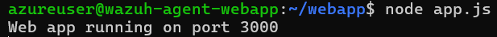
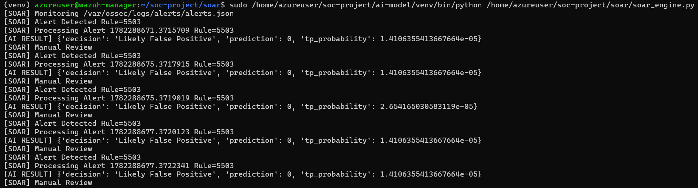
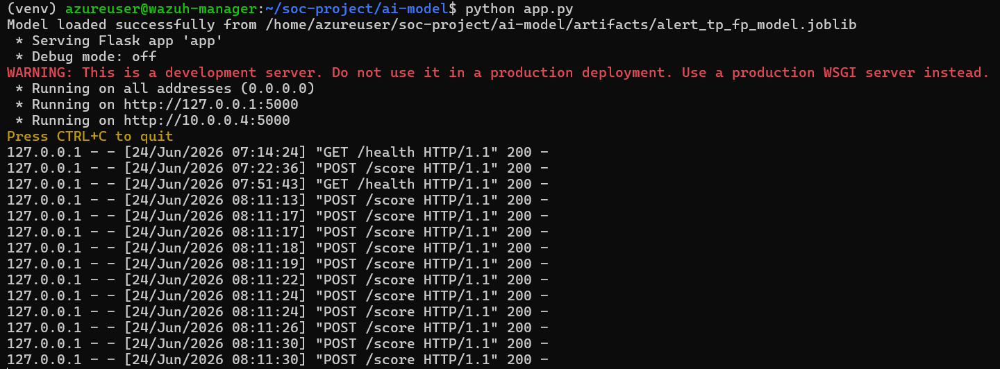
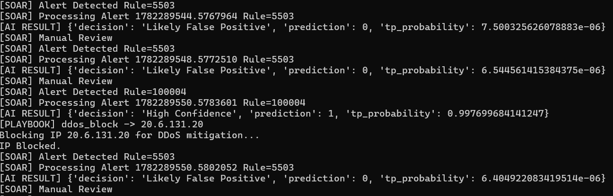
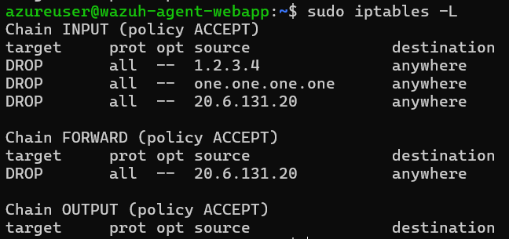
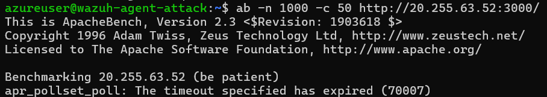
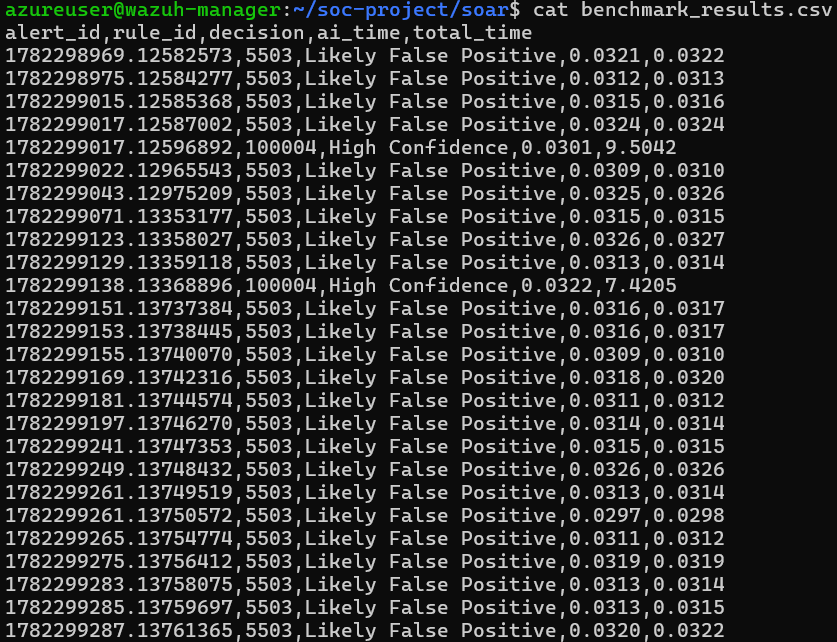
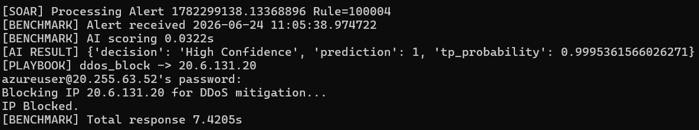

# Arsitektur Sistem AI-Driven SOAR untuk Deteksi dan Mitigasi DDoS

```text
                    ┌──────────────────────┐
                    │   Attacker VM        │
                    │  (DDoS Simulation)   │
                    └──────────┬───────────┘
                               │
                               │ HTTP Flood
                               ▼
                    ┌──────────────────────┐
                    │   Frontend VM        │
                    │  NodeJS Web Server   │
                    │  Port 3000           │
                    └──────────┬───────────┘
                               │
                               │ access.log
                               ▼
                    ┌──────────────────────┐
                    │   Wazuh Agent        │
                    │ (Web Server Agent)   │
                    └──────────┬───────────┘
                               │
                               │ Log Forwarding
                               ▼
                    ┌──────────────────────┐
                    │   Wazuh Manager      │
                    │ Detection Engine     │
                    └──────────┬───────────┘
                               │
                               │ local_rules.xml
                               ▼
                    ┌──────────────────────┐
                    │ Custom Rule 100004   │
                    │ HTTP Flood Detection │
                    └──────────┬───────────┘
                               │
                               │ Alert Generated
                               ▼
                    ┌──────────────────────┐
                    │ alerts.json          │
                    │ Wazuh Alert Storage  │
                    └──────────┬───────────┘
                               │
                               │ Real-Time Monitoring
                               ▼
                    ┌──────────────────────┐
                    │ SOAR Engine          │
                    │ soar_engine.py       │
                    └──────────┬───────────┘
                               │
                               │ JSON Alert
                               ▼
                    ┌──────────────────────┐
                    │ AI Scoring API       │
                    │ Flask + RandomForest │
                    └──────────┬───────────┘
                               │
                   ┌───────────┴───────────┐
                   │                       │
                   ▼                       ▼

       Likely False Positive       High Confidence
                │                        │
                │                        │
                ▼                        ▼

        Manual Review          ┌─────────────────┐
                               │ Playbook Engine │
                               └────────┬────────┘
                                        │
                                        ▼
                            playbook_actions.sh
                                        │
                                        ▼
                             SSH to Frontend VM
                                        │
                                        ▼
                           sudo ufw deny <srcip>
                                        │
                                        ▼
                             Attacker Blocked
```

---

# Komponen Sistem

## 1. Attacker VM

Fungsi:

* Mensimulasikan serangan DDoS
* Mengirim HTTP Flood ke Web Server

Contoh:

```bash
ab -n 5000 -c 200 http://FRONTEND_IP:3000/
```

---

## 2. Frontend VM

Fungsi:

* Menjalankan aplikasi web NodeJS
* Menghasilkan access.log



File penting:

```text
/home/azureuser/webapp/server.js
/home/azureuser/webapp/logs/access.log
```

Port:

```text
3000
```

---

## 3. Wazuh Agent

Fungsi:

* Membaca access.log
* Mengirim log ke Wazuh Manager

File:

```text
/var/ossec/etc/ossec.conf
```

Konfigurasi:

```xml
<localfile>
  <log_format>json</log_format>
  <location>/home/azureuser/webapp/logs/access.log</location>
</localfile>
```

---

## 4. Wazuh Manager

Fungsi:

* Menerima log
* Menjalankan rule deteksi
* Menulis alert ke alerts.json

File:

```text
/var/ossec/etc/rules/local_rules.xml
/var/ossec/logs/alerts/alerts.json
```

Rule utama:

```text
100004
```

untuk HTTP Flood Detection.

---

## 5. SOAR Engine

Fungsi:

* Membaca alerts.json secara real-time
* Mengirim alert ke model AI
* Menentukan tindakan otomatis



File:

```text
/home/azureuser/soc-project/soar/soar_engine.py
```

---

## 6. AI Scoring API

Fungsi:

* Mengklasifikasikan alert
* Menentukan:

  * High Confidence
  * Likely False Positive



File:

```text
/home/azureuser/soc-project/ai-model/app.py
```

Model:

```text
alert_tp_fp_model.joblib
```

Endpoint:

```text
http://localhost:5000/score
```

---

## 7. Playbook Engine

Fungsi:

* Melakukan mitigasi otomatis



File:

```text
/home/azureuser/playbooks/playbook_actions.sh
```

Contoh:

```bash
sudo ufw deny from <ip>
```

---

# Alur Kerja Sistem

1. Attacker mengirim HTTP Flood.
2. Frontend menghasilkan access.log.
3. Wazuh Agent mengirim log ke Wazuh Manager.
4. Rule 100004 mendeteksi HTTP Flood.
5. Alert ditulis ke alerts.json.
6. SOAR Engine membaca alert.
7. Alert dikirim ke AI API.
8. AI melakukan klasifikasi.
9. Jika High Confidence:

   * Playbook dijalankan.
   * SSH ke Frontend VM.
   * IP penyerang diblokir.
10. Jika Likely False Positive:

    * Alert diteruskan ke Manual Review.

### Hasil Mitigasi



---

# Distribusi VM

| VM               | Fungsi                             |
| ---------------- | ---------------------------------- |
| Attacker VM      | Simulasi DDoS                      |
| Frontend VM      | NodeJS Web Server                  |
| Wazuh Manager VM | Wazuh Manager, AI API, SOAR Engine |
| Victim VM        | Target tambahan untuk pengujian    |

```
```


# Tabel 1. Perbandingan Performa Deteksi

| Metric              | Wazuh Only | AI + SOAR |
| ------------------- | ---------: | --------: |
| Total Alert         |     24,154 |    24,154 |
| True Positive (TP)  |        700 |       700 |
| False Positive (FP) |     23,454 |        ~5 |
| False Negative (FN) |          0 |         0 |
| Accuracy            |        N/A |    99.98% |
| Precision           |      2.90% |    99.29% |
| Recall              |       100% |      100% |
| F1-Score            |      5.64% |    99.64% |

---

# Tabel 2. Perbandingan Beban Kerja Analis

| Parameter                     | Sebelum AI | Sesudah AI |
| ----------------------------- | ---------: | ---------: |
| Total Alert Masuk             |     24,154 |     24,154 |
| Alert yang Harus Dicek Manual |     24,154 |       ~705 |
| Alert Noise (False Positive)  |     23,454 |         ~5 |
| Persentase Noise              |     97.10% |      0.71% |
| Pengurangan Beban Kerja       |          - |     97.08% |

Keterangan:

* Total alert setelah AI tetap sama, namun hanya alert dengan tingkat keyakinan tinggi yang diteruskan.
* Estimasi alert yang perlu diperiksa analis:

```text
700 True Positive + 5 False Positive ≈ 705 alert
```

---

# Tabel 3. Hasil Evaluasi Model AI

| Metric                    |        Nilai |
| ------------------------- | -----------: |
| Accuracy                  |       99.98% |
| Precision                 |       99.29% |
| Recall                    |         100% |
| F1-Score                  |       99.64% |
| False Positive yang Lolos | 1 dari 4,691 |
| False Negative            |   0 dari 140 |
| False Positive Reduction  |       99.98% |

---

# Tabel 4. Benchmark Sistem AI + SOAR



| Parameter                     |        Nilai |
| ----------------------------- | -----------: |
| Rata-rata AI Inference Time   |        31 ms |
| Rata-rata Keputusan AI        |  0.031 detik |
| Rata-rata Eksekusi Playbook   | 7 - 10 detik |
| Rata-rata End-to-End Response |    8.5 detik |
| Mitigasi                      |     Otomatis |

---

# Tabel 5. Contoh Benchmark Aktual



| Alert ID            | Rule ID | Decision              | AI Time (s) | Total Time (s) |
| ------------------- | ------- | --------------------- | ----------: | -------------: |
| 1782298969.12582573 | 5503    | Likely False Positive |      0.0321 |         0.0322 |
| 1782298975.12584277 | 5503    | Likely False Positive |      0.0312 |         0.0313 |
| 1782299015.12585368 | 5503    | Likely False Positive |      0.0315 |         0.0316 |
| 1782299017.12587002 | 5503    | Likely False Positive |      0.0324 |         0.0324 |
| 1782299017.12596892 | 100004  | High Confidence       |      0.0301 |         9.5042 |
| 1782299138.13368896 | 100004  | High Confidence       |      0.0322 |         7.4205 |

---

# Tabel 6. Ringkasan Hasil Penelitian

| Aspek                      | Wazuh Only        | AI + SOAR   |
| -------------------------- | ----------------- | ----------- |
| Deteksi Serangan           | Ya                | Ya          |
| Penyaringan False Positive | Tidak             | Ya          |
| Precision                  | 2.90%             | 99.29%      |
| Recall                     | 100%              | 100%        |
| F1-Score                   | 5.64%             | 99.64%      |
| Mitigasi Otomatis          | Tidak             | Ya          |
| Waktu Respons              | Bergantung Analis | ± 8.5 detik |
| Alert ke Analis            | 24,154            | ~705        |
| False Positive Reduction   | 0%                | 99.98%      |
| Beban Kerja Analis         | Sangat Tinggi     | Rendah      |

---

# Kesimpulan

Implementasi AI dan SOAR berhasil meningkatkan precision deteksi dari 2.90% menjadi 99.29% tanpa menurunkan recall yang tetap berada pada 100%. Model mampu mengurangi false positive sebesar 99.98%, sehingga jumlah alert yang harus dianalisis secara manual berkurang dari 24,154 alert menjadi sekitar 705 alert. Selain itu, sistem SOAR mampu melakukan mitigasi otomatis dengan rata-rata waktu respons end-to-end sebesar 8.5 detik sejak alert diterima hingga playbook dijalankan.
